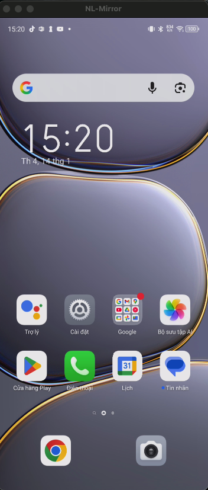
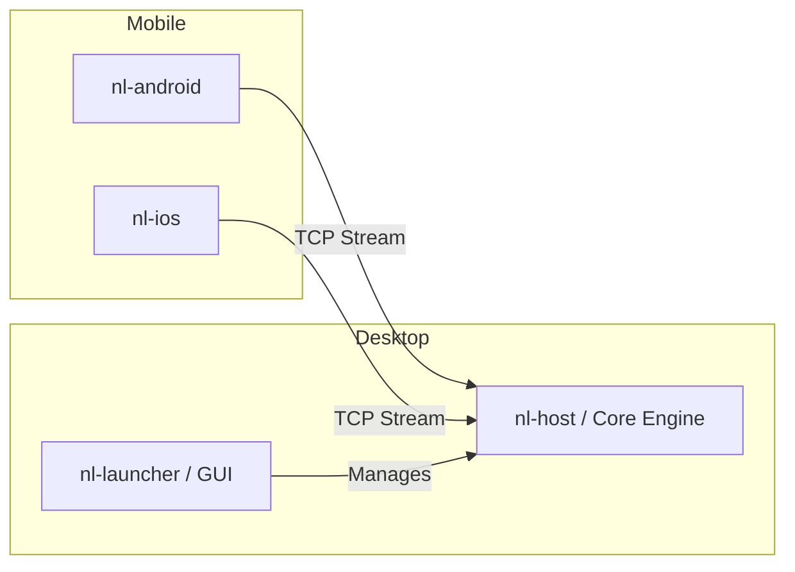

# NL-Mirror

**NL-Mirror** is a high-performance, low-latency cross-platform screen mirroring solution for Android and iOS, featuring a powerful desktop launcher and a core engine built in Rust.

## 🚀 Features

- **High Speed & Low Latency**: Optimized for real-time mirroring with minimal lag (latency < 50ms).
- **Cross-Platform Support**: Mirror both Android and iOS devices to your desktop.
- **Wireless Connection**: Connect devices seamlessly over WiFi using QR code pairing (Android) or manual IP (iOS).
- **Audio Streaming**: Support for Android 11+ internal audio streaming.
- **Desktop Launcher**: Modern, easy-to-use desktop application built with Tauri and React.
- **Core Engine (nl-host)**: High-performance Rust-based CLI engine for video decoding and rendering.
- **Remote Control**: Support for keyboard/mouse interaction and clipboard synchronization.

## 🏗 Architecture

NL-Mirror consists of several components working together:

- **`nl-launcher`**: The desktop GUI (Tauri + React) that manages connections and launches the mirror sessions.
- **`nl-host`**: The core Rust engine that handles video stream reception, H.264 decoding, and rendering (using `wgpu` or native APIs).
- **`nl-android`**: Android application that captures the screen and streams it via TCP.
- **`nl-ios`**: iOS application using ReplayKit to broadcast the screen.

## 📋 Prerequisites

- **Desktop**: macOS, Windows, or Linux.
- **Android**: Device running Android 10+ (Android 11+ for audio).
- **iOS**: Device running iOS 14.0+.
- **Network**: Both desktop and mobile devices must be on the same local network.

## 🛠 Installation & Usage

### 1. Download & Install
Download the latest release for your platform from the [Releases](https://github.com/Nghi-NV/nl-mirror/releases) page.

### 2. Connect Your Device

#### Android
1. Open the **NL-Mirror** app on your Android device.
2. In the desktop launcher, scan the **QR Code** displayed on the "Wireless Connection" card.
3. Accept the connection request on your device.

#### iOS
1. Build and install the **nl-ios** app using Xcode.
2. Open the app on your iPhone/iPad and note the displayed IP address.
3. In the desktop launcher, enter the IP address or follow the iOS instructions to start the broadcast extension.

## 🛡 Security Note

NL-Mirror is designed for use within a **trusted local network**.
- **Unencrypted Streams**: Video and audio streams are currently unencrypted for performance reasons.
- **ADB Connection**: The pairing mechanism uses ADB over WiFi for Android, which grants significant control over the device. Only connect to computers you trust.

## 🤝 Contributing

Contributions are welcome! Please feel free to submit a Pull Request or open an issue for bugs and feature requests.

1. Fork the Project
2. Create your Feature Branch (`git checkout -b feature/AmazingFeature`)
3. Commit your Changes (`git commit -m 'Add some AmazingFeature'`)
4. Push to the Branch (`git push origin feature/AmazingFeature`)
5. Open a Pull Request

## 📄 License

Distributed under the MIT License. See `LICENSE` for more information.

---
Built with ❤️ by [Nghi Nguyen](https://github.com/Nghi-NV)
